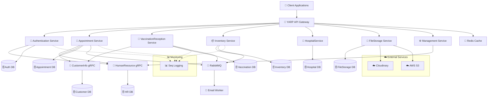
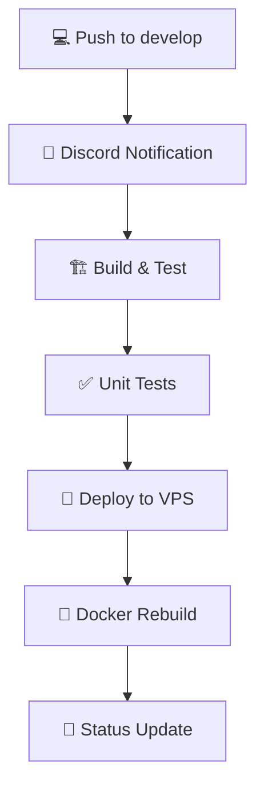
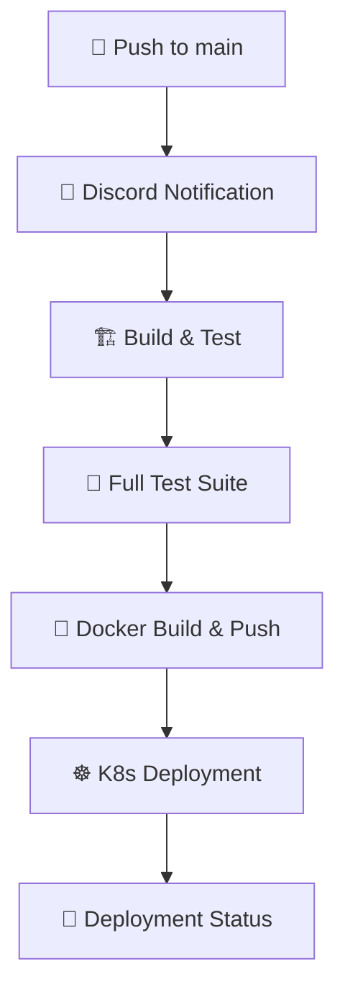

# 🏥 MediFlow

<div align="center">


**A modern hospital workflow management system focusing on vaccination and medical examination processes**

[](https://github.com/ddnhuy/MediFlow_BE/actions)
[](https://sonarcloud.io/)
[](https://hub.docker.com/)
[](https://kubernetes.io/)
[](LICENSE.txt)

</div>

---

## 📋 Overview

**MediFlow** is designed with a **microservices architecture** to ensure scalability, maintainability, and seamless integration with existing healthcare systems. This project serves as the graduation thesis for a team of software engineering students, demonstrating enterprise-level development practices and modern cloud-native technologies.

## 🛠️ Technology Stack

<table>
<tr>
<td valign="top" width="50%">

### Backend & Core
-  **ASP.NET Core Web API**
-  **Database**
-  **Caching**
-  **Message Queue**
-  **Communication**

### DevOps & Infrastructure
-  **Containerization**
-  **Orchestration**
-  **Package Manager**
-  **CI/CD**

</td>
<td valign="top" width="50%">

### Libraries & Frameworks
-  **API Gateway**
-  **Authentication**
-  **Logging**
-  **Messaging**
-  **Object Mapping**

### Cloud & Storage
-  **File Storage**
-  **Media Management**
-  **Code Quality**

</td>
</tr>
</table>

## 🏗️ System Architecture

<div align="center">



</div>

### 🔧 Architecture Patterns
- **🎯 Microservices Architecture** - Individual services with dedicated databases
- **🚪 API Gateway** - YARP for request routing and load balancing  
- **⚡ Event-Driven** - RabbitMQ message broker for asynchronous communication
- **🚀 gRPC Communication** - High-performance inter-service communication
- **📋 CQRS Pattern** - Command Query Responsibility Segregation implementation
- **🐳 Docker Containers** - Fully containerized microservices

## 🧩 Microservices Architecture

<div align="center">

| Service | Type | Port | Description | Technologies |
|---------|------|------|-------------|--------------|
| 🚪 **API Gateway** | Gateway | 6060 | Request routing & load balancing | YARP, Rate Limiting |
| 🔐 **Authentication** | REST API | 6062 | User auth & JWT management | ASP.NET Identity, JWT |
| 👥 **HumanResource** | gRPC | 6061 | Employee, roles & departments | gRPC, PostgreSQL |
| 👤 **CustomerInfo** | gRPC | 6064 | Patient information | gRPC, PostgreSQL |
| 📅 **Appointment** | REST API | 6069 | Scheduling & notifications | Quartz.NET, MassTransit |
| 💉 **VaccinationReception** | REST API | 6065 | Vaccination processes | Carter, FluentValidation |
| 📦 **Inventory** | REST API | 6063 | Medicine & vaccine inventory | PostgreSQL, MassTransit |
| 🏥 **HospitalService** | REST API | 6067 | Hospital services & fees | PostgreSQL |
| 📁 **FileStorage** | REST API | 6068 | Document & image storage | Cloudinary, AWS S3 |
| ⚙️ **Management** | REST API | 6066 | Administrative operations | gRPC Clients |
| 📧 **Email Worker** | Background | - | Email notifications | MassTransit, RabbitMQ |

</div>

### 🔧 Shared Infrastructure

<div align="center">

| Component | Port | Purpose | Configuration |
|-----------|------|---------|---------------|
| 🗄️ **PostgreSQL** | 5432 | Primary database | Multiple databases per service |
| 🔴 **Redis** | 6379 | Caching layer | Password: `Mediflow@123` |
| 🐰 **RabbitMQ** | 5672/15672 | Message broker | User: `mediflow` |
| 📊 **Seq** | 5341/5342 | Centralized logging | Web UI + Ingestion |

</div>

## 🚀 Deployment Guide

### 🔧 Quick Start

<details>
<summary><b>🛠️ Development Environment</b></summary>

```bash
# Clone the repository
git clone https://github.com/ddnhuy/MediFlow_BE.git
cd MediFlow_BE

# Run with Docker Compose (Development)
docker-compose -f docker-compose.yml -f docker-compose.override.yml up -d

# Check services status
docker-compose ps
```

**Available at:**
- 🚪 API Gateway: http://localhost:6060
- 📊 Seq Logging: http://localhost:5342
- 🐰 RabbitMQ Management: http://localhost:15672
</details>

<details>
<summary><b>🌟 Production Environment</b></summary>

```bash
# Run with Docker Compose (Production)
docker-compose -f docker-compose.yml -f docker-compose.release.yml up -d

# Monitor logs
docker-compose logs -f
```

**Features:**
- 🔒 SSL/TLS certificates with Let's Encrypt
- 🌍 Domain-based routing
- 📈 Production-optimized settings
</details>

### ☸️ Kubernetes Deployment

<div align="center">

**🎯 Production-Ready Kubernetes Deployment with Advanced Orchestration**

</div>

#### 💡 Why Kubernetes?

<table>
<tr>
<td width="50%">

**🔄 Scalability & Performance**
- 📈 **Auto-scaling**: HPA based on CPU/memory
- ⚖️ **Load Balancing**: Built-in service discovery
- 🚀 **High Performance**: Optimized resource allocation

**🛡️ Reliability & Security**
- 🔧 **Self-healing**: Automatic pod restart
- 🔒 **Security**: RBAC, Secrets, NetworkPolicies
- 💾 **Persistence**: StatefulSets with PVCs

</td>
<td width="50%">

**🔄 Operations & Management**
- 🚀 **Zero Downtime**: Rolling updates
- 📊 **Monitoring**: Built-in health checks
- 🔄 **Rollback**: Easy version management
- ⚙️ **Configuration**: ConfigMaps & Secrets

</td>
</tr>
</table>

#### 📋 Deployment Commands

```bash
# Deploy to Kubernetes using Helm
helm install mediflow ./helm --namespace mediflow --create-namespace

# Upgrade deployment with zero downtime
helm upgrade mediflow ./helm --wait --timeout=10m

# Scale specific services
kubectl scale deployment appointment-api --replicas=3 -n mediflow

# Monitor deployment status
kubectl get pods,svc,ingress -l app.kubernetes.io/instance=mediflow -n mediflow
```

#### 🎛️ Kubernetes Resources

<div align="center">

| Resource Type | Usage | Purpose |
|---------------|-------|---------|
| 🚀 **Deployments** | All microservices | Stateless application management |
| 🗃️ **StatefulSets** | PostgreSQL, Redis, RabbitMQ | Stateful services with persistent storage |
| 🌐 **Services** | All components | Internal service discovery & load balancing |
| 🔗 **Ingress** | External access | NGINX-based external traffic routing |
| ⚙️ **ConfigMaps** | Configuration | Environment-specific settings |
| 🔐 **Secrets** | Credentials | Secure storage for sensitive data |
| 💾 **PVCs** | Databases | Persistent data storage |

</div>

## 🔄 CI/CD Pipeline

<div align="center">

**⚡ Automated Testing, Building, and Deployment with GitHub Actions**


</div>

### 🔄 Workflow Overview

<table>
<tr>
<td width="50%">

#### 🧪 **Testing Environment** 
**Branch:** `develop`



</td>
<td width="50%">

#### 🌟 **Production Environment**
**Branch:** `main`



</td>
</tr>
</table>

### 📋 Pipeline Details

<details>
<summary><b>🧪 Testing Environment Pipeline</b></summary>

| Stage | Description | Tools Used |
|-------|-------------|------------|
| 📢 **Notification** | Workflow started alert | Discord Webhook |
| 🏗️ **Build** | .NET 8.0 SDK setup & build | dotnet CLI |
| ✅ **Test** | Unit tests with coverage | test.runsettings |
| 🚀 **Deploy** | VPS deployment via SSH | Docker Compose |
| 🧹 **Cleanup** | Build cache cleanup | Docker system prune |
| 📢 **Status** | Success/failure notification | Discord Webhook |

**Features:**
- ⚡ Fast feedback loop for development
- 🔄 Automatic VPS deployment
- � Real-time notifications

</details>

<details>
<summary><b>🌟 Production Environment Pipeline</b></summary>

| Stage | Description | Tools Used |
|-------|-------------|------------|
| 📢 **Notification** | Production deployment alert | Discord Webhook |
| 🏗️ **Build** | .NET 8.0 SDK & solution build | dotnet CLI |
| 🧪 **Test** | Comprehensive test suite | NUnit, xUnit |
| 🐳 **Docker** | Multi-arch image build & push | Docker Hub |
| ☸️ **Deploy** | Kubernetes deployment | Helm Charts |
| 🔄 **Update** | Rolling update with health checks | kubectl |
| 📢 **Status** | Deployment completion status | Discord Webhook |

**Features:**
- 🎯 Zero-downtime deployments
- � Production-grade security
- 📈 Automatic scaling
- 🔄 Easy rollback capability

</details>

<details>
<summary><b>🔍 Code Quality Pipeline</b></summary>

| Stage | Description | Metrics |
|-------|-------------|---------|
| 🔧 **Setup** | JDK 17 & .NET 8.0 environment | Multi-runtime |
| 📊 **Analysis** | SonarQube Cloud scanning | Coverage, Security |
| 🛡️ **Security** | Vulnerability assessment | OWASP, CVE |
| 🧹 **Quality** | Code smell detection | Maintainability |
| 💡 **Debt** | Technical debt analysis | Complexity |
| ✅ **Gate** | Quality gate validation | Pass/Fail |

**Quality Standards:**
- 📈 **Coverage**: >80% code coverage
- 🛡️ **Security**: Zero high/critical vulnerabilities  
- 📊 **Maintainability**: A rating
- 🔄 **Reliability**: A rating

</details>

### 🛠️ CI/CD Features

<div align="center">

| Feature | Development | Production |
|---------|-------------|------------|
| 🤖 **Automation** | ✅ Full automation | ✅ Full automation |
| 🧪 **Testing** | ✅ Unit tests | ✅ Comprehensive suite |
| 🐳 **Containerization** | ✅ Docker Compose | ✅ Kubernetes ready |
| 📢 **Notifications** | ✅ Discord webhooks | ✅ Multi-channel alerts |
| 🔒 **Security** | ✅ Basic scanning | ✅ Full security audit |
| 📊 **Monitoring** | ✅ Basic metrics | ✅ Advanced observability |
| 🔄 **Rollback** | ✅ Git revert | ✅ Helm rollback |

</div>

---

## ⚙️ Configuration

<details>
<summary><b>🌍 Environment Variables (Production)</b></summary>

### SSL & Domain Configuration
```bash
DOMAIN=your-domain.com                    # Your domain name for SSL certificates
CERT_PATH=/path/to/cert.pem              # SSL certificate path
CERT_KEYPATH=/path/to/private.key        # SSL certificate key path
```

### File Storage Configuration
```bash
# Cloudinary Settings
CLOUDINARY_CLOUD_NAME=your-cloud-name
CLOUDINARY_API_KEY=your-api-key
CLOUDINARY_API_SECRET=your-api-secret

# AWS S3 Settings
AWS_BUCKET_NAME=your-s3-bucket
AWS_REGION=us-east-1
AWS_ACCESS_KEY=your-access-key
AWS_SECRET_KEY=your-secret-key
```

### Email Service Configuration
```bash
EMAIL_SERVER=smtp.gmail.com
EMAIL_PORT=587
EMAIL_SENDER_NAME=MediFlow System
EMAIL_SENDER_EMAIL=noreply@mediflow.com
EMAIL_SENDER_PASSWORD=your-app-password
```

</details>

<details>
<summary><b>🔗 Service Ports & Endpoints</b></summary>

<div align="center">

### 🎯 Core Services

| Service | HTTP Port | HTTPS Port | Health Check |
|---------|-----------|------------|--------------|
| 🚪 **API Gateway** | 6060 | - | `/health` |
| 🔐 **Authentication** | 6062 | - | `/health` |
| ⚙️ **Management** | 6066 | - | `/health` |
| 📦 **Inventory** | 6063 | - | `/health` |

### 🌐 gRPC Services

| Service | HTTP Port | HTTPS Port | gRPC Endpoint |
|---------|-----------|------------|---------------|
| 👥 **HumanResource** | 6061 | 8081 | `grpc://localhost:6061` |
| 👤 **CustomerInfo** | 6064 | 8081 | `grpc://localhost:6064` |

### 🏥 Medical Services

| Service | HTTP Port | HTTPS Port | Purpose |
|---------|-----------|------------|---------|
| 📅 **Appointment** | 6069 | 8081 | Appointment management |
| 💉 **VaccinationReception** | 6065 | 8081 | Vaccination processes |
| 🏥 **HospitalService** | 6067 | 8081 | Hospital operations |
| 📁 **FileStorage** | 6068 | 8081 | Document management |

### 🗄️ Infrastructure

| Component | Port | Management UI | Credentials |
|-----------|------|---------------|-------------|
| 🗄️ **PostgreSQL** | 5432 | - | postgres/postgres |
| 🔴 **Redis** | 6379 | - | Password: `Mediflow@123` |
| 🐰 **RabbitMQ** | 5672 | [15672](http://localhost:15672) | mediflow/Mediflow@123 |
| 📊 **Seq Logging** | 5341 | [5342](http://localhost:5342) | No authentication |

</div>

</details>

---

## 🤝 Contributing

<div align="center">

[](https://github.com/ddnhuy/MediFlow_BE/contributors)
[](https://github.com/ddnhuy/MediFlow_BE/issues)
[](https://github.com/ddnhuy/MediFlow_BE/pulls)

</div>

### 📋 Development Workflow

1. 🍴 **Fork** the repository
2. 🌿 **Create** a feature branch (`git checkout -b feature/AmazingFeature`)
3. 💻 **Commit** your changes (`git commit -m 'Add some AmazingFeature'`)
4. 📤 **Push** to the branch (`git push origin feature/AmazingFeature`)
5. 🔄 **Open** a Pull Request

### 🧪 Running Tests

```bash
# Run all tests
dotnet test MediFlow.sln

# Run tests with coverage
dotnet test MediFlow.sln --collect:"XPlat Code Coverage"

# Run specific test project
dotnet test tests/AppointmentService/AppointmentService.UnitTests
```

---

<div align="center">

**Made with ❤️ by the MediFlow Team**

</div>
